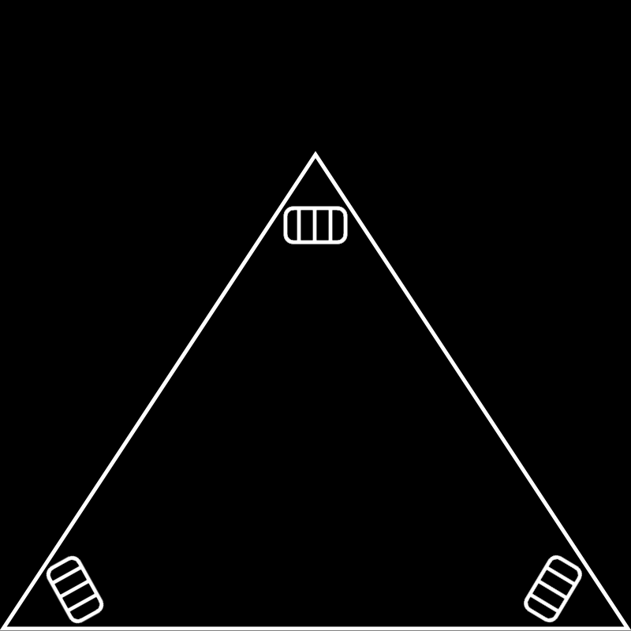
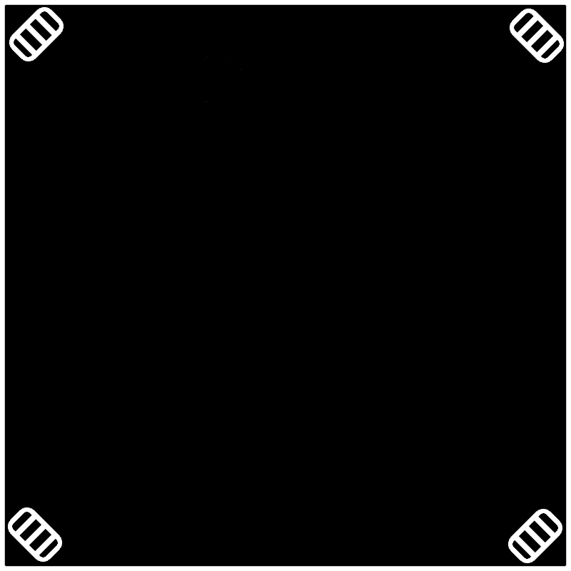
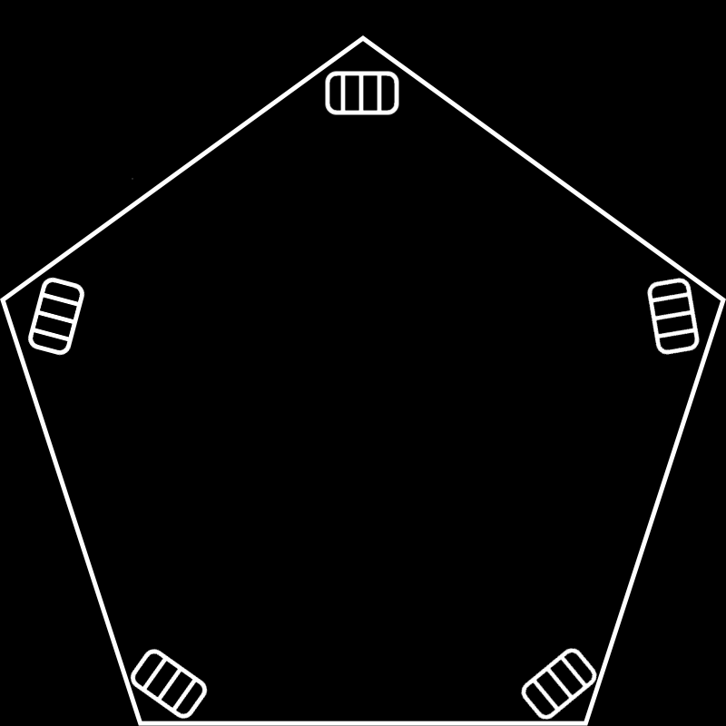

# Tracking Algorithms and Kinematic Equations for Robotics Drivetrains

### Explanations and mathematic equations for the following drivetrain configurations

## Tracking
 - 2-wheel odometry calculations (for non-strafing robots) 

 - 3-wheel odometry calculations (for strafing/holonomic robots)

---
## Kinematics

 - Tri Kiwi drive (field oriented option)

 - Quad Kiwi drive (field oriented option)

 - Penta Kiwi drive (field oriented option)

 - Holonomic (mecanum) drive (field oriented option)

 - Differential drive (tank option)

